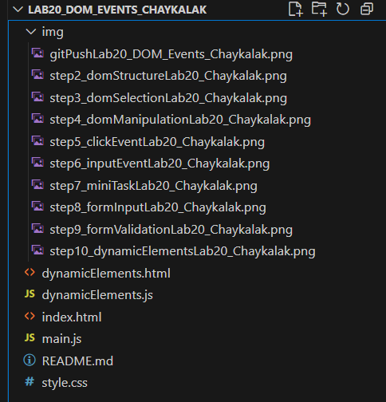

# Лабораторная работа №20: Работа с DOM и событиями в JavaScript

## Основная информация

**ФИО:** чайкалак Данара Рустамовна

**Группа:** ИСП-231

**Дата:** 05.06.2026

## Описание

В ходе выполнения лабораторной работы были изучены следующие темы:

1. **DOM (Document Object Model)** – объектная модель HTML-документа, представленная в виде древовидной структуры
2. **Поиск элементов** – `getElementById()`, `querySelector()`
3. **Изменение содержимого и стилей** – `textContent`, `style`
4. **События** – `addEventListener()`, обработка кликов, отправки форм
5. **Работа с формами** – получение значений (`value`), валидация, `event.preventDefault()`
6. **Динамическое создание элементов** – `createElement()`, `appendChild()`, делегирование событий

## Структура проекта



## Сравнение с C# (WinForms/WPF)

### DOM в JS = Controls в C# WinForms

| Концепция | C# (WinForms) | JavaScript (DOM) |
|-----------|---------------|------------------|
| Найти элемент | `Button myButton = this.Controls["myButton"]` | `const myButton = document.getElementById("myButton")` |
| Изменить текст | `label1.Text = "Новый текст"` | `label1.textContent = "Новый текст"` |
| Добавить обработчик | `button1.Click += HandleClick` | `button.addEventListener("click", handleClick)` |
| Создать элемент | `Button btn = new Button()` | `const btn = document.createElement("button")` |
| Добавить в контейнер | `panel1.Controls.Add(btn)` | `panel.appendChild(btn)` |
| Скрыть элемент | `button1.Visible = false` | `button.style.display = "none"` |

### События в JS = События в C#

**C# (WinForms):**
```csharp
private void Button1_Click(object sender, EventArgs e)
{
    label1.Text = "Нажато!";
}
```
**JavaScript (DOM):**
```javascript
button.addEventListener("click", (e) => {
    label1.textContent = "Нажато!";
});
```

### Валидация формы

**C# (WinForms):**

```csharp
private void SubmitButton_Click(object sender, EventArgs e)
{
    if (string.IsNullOrEmpty(nameTextBox.Text))
    {
        MessageBox.Show("Введите имя!");
        return;
    }
}
```
**JavaScript (DOM):**
```javascript
form.addEventListener("submit", (e) => {
    e.preventDefault();
    if (!nameInput.value.trim()) {
        alert("Введите имя!");
        return;
    }
});
```
## Главные отличия:

| Аспект | C# WinForms | JavaScript DOM |
|--------|-------------|----------------|
| Компиляция | Да | Нет (интерпретация) |
| Типизация | Строгая | Динамическая |
| Ошибки | Во время компиляции | Во время выполнения |
| UI-дизайнер | Есть (визуальный) | Нет (только код) |
| Платформа | Windows | Любой браузер |

### Преимущества DOM перед WinForms:

- Кроссплатформенность (работает везде)
- Не нужна установка приложения
- Легко обновлять (обновил файлы — всё работает)
- Современные UI (CSS, анимации)

### Преимущества WinForms перед DOM:

- Визуальный дизайнер (drag & drop)
- Ошибки на этапе компиляции
- Интеграция с Windows API
- Более понятная структура

**Вывод:** DOM и WinForms решают схожие задачи, но разными подходами.